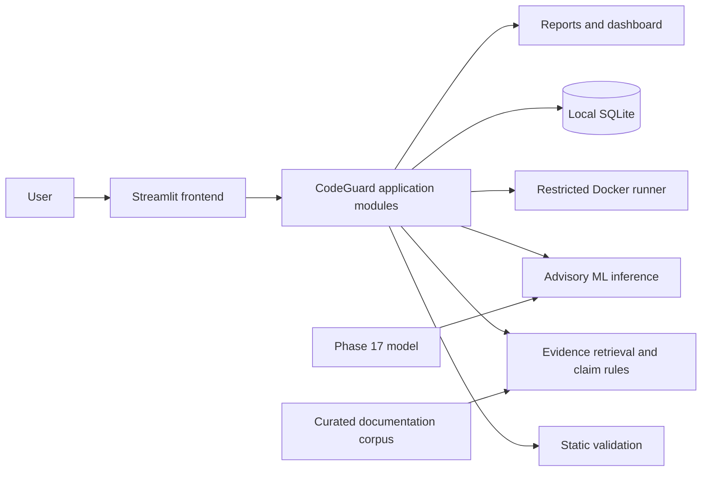

# CodeGuard AI

CodeGuard AI is a local research application for inspecting AI-generated Python answers through static checks, optional isolated execution, and evidence-aware explanation analysis.

> **Status:** Active research and development. This project is not production-ready and does not provide a guarantee of code safety or factual correctness.

## What It Does

CodeGuard extracts Python code and explanation text from an answer, checks syntax and selected risk patterns, can run code and user-supplied function tests inside Docker, compares saved responses, and analyzes a limited set of explanation claims against a small curated Python documentation corpus. It can optionally request an answer from the OpenAI Responses API.

## Architecture



The frontend coordinates user workflows and displays results. Application modules, evidence retrieval, execution, persistence, and ML inference live in the installable `codeguard` package under `backend/src/`.

## Project Structure

```text
frontend/       Streamlit application entry point
backend/src/    Installable CodeGuard application package
  codeguard/    Analysis, execution, evidence, storage, reports, and ML modules
tests/          Unit, integration, Docker, and Phase 18 tests
data/           Local state, source data, processed datasets, and metadata
models/         Phase 17 and claim-verifier model artifacts
scripts/        Dataset download and reproducible training workflows
docs/           Architecture, phase history, research, and demo guides
reports/        Machine-readable results and generated figures
```

## Features

- Manual response entry works without an API key.
- Python fence extraction, AST syntax validation, and selected static risk checks.
- Docker-backed code execution and function tests; there is no host-execution fallback.
- Local TF-IDF retrieval over a small curated corpus derived from official Python documentation, with source evidence and URLs.
- Conservative claim extraction and narrow proposition rules; similarity alone does not establish support or contradiction.
- SQLite-backed evaluation history, comparisons, and descriptive JSON reliability reports.
- Dataset review tools distinguish proposed labels from independent review and adjudication.

## ML Component

Phase 17 provides an auxiliary regressor for the upstream `pass_rate` target on a bounded NVIDIA OpenCodeReasoning-2 Python sample. It is not trained on CodeGuard claim labels and does not prove general code correctness or safety. The smaller synthetic claim-verifier pilot is another advisory signal, not documentary evidence. See [the model card](docs/research/MODEL_CARD.md) and [Phase 17 research](docs/research/PHASE_17_DATASET_RESEARCH.md).

## Docker Sandbox

Submitted code runs only in Docker with networking disabled, a read-only root filesystem, user/group `65534:65534`, 128 MiB memory, 0.5 CPU, a 32-process limit, timeout controls, and output limits. These restrictions reduce risk but do not make the runner a production-grade security boundary. Do not expose this local application as a public code-execution service.

## Dataset

Raw Phase 17 Parquet shards are not committed. The repository preserves dataset revision, source, license notes, download metadata, and reproduction instructions in [data/README.md](data/README.md). The Phase 17 dataset is an auxiliary execution pass-rate source, not a human-labeled claim-verification corpus. Earlier research datasets are primarily synthetic and some labels remain pending review.

## Installation

Python 3.10 or newer is required. Docker Desktop with its Linux engine is needed for isolated execution.

```powershell
py -m venv .venv
.\.venv\Scripts\Activate.ps1
python -m pip install -r requirements.txt
```

For development and the test suite, install `requirements-dev.txt` as well:

```powershell
python -m pip install -r requirements-dev.txt
```

Copy `.env.example` to `.env` and set `OPENAI_API_KEY` only if you intend to use the optional provider. API calls can incur charges. The application reads keys from the process environment; `.env` loading is not automatic.

## Running Locally

From the repository root:

```powershell
python -m streamlit run frontend/app.py
```

Open the local address printed by Streamlit, normally [http://localhost:8501](http://localhost:8501). Pull the execution image once if you intend to use Docker-backed features:

```powershell
docker pull python:3.12-slim
```

## Testing

Run the full discovered suite from the repository root:

```powershell
python -m pytest
```

Docker integration tests require a running Docker engine and can be enabled with:

```powershell
$env:CODEGUARD_DOCKER_INTEGRATION = "1"
python -m pytest tests/docker
```

## Demo

See [the demo guide](docs/demo/DEMO_GUIDE.md) and [Phase 18 demo cases](docs/demo/PHASE_18_DEMO_CASES.md). Machine-readable example outputs are under `reports/phase18/`.

## Current Status

The application and research workflows are under active development. Phase history and known project status are recorded in [the progress log](docs/phases/PROJECT_PROGRESS.md). Model metrics reflect the documented datasets and evaluation procedures only; they should not be treated as production performance estimates.

## Known Limitations

- Explanation verification recognizes a narrow set of claim patterns and corpus facts.
- Retrieval can miss relevant evidence; retrieved similarity is not a truth score.
- The ML datasets are small or domain-specific, and the Phase 17 target is an upstream automated benchmark value.
- Docker isolation and the host kernel can contain vulnerabilities.
- Local SQLite files may contain sensitive prompts and responses.

## Future Work

Improve human-reviewed claim data and independent evaluation, broaden evidence coverage, strengthen reproducibility, and continue evaluating sandbox behavior without weakening the existing execution restrictions.

## License

No project license file was present in the supplied repository, so no project reuse license is asserted here. Dataset and upstream source licenses continue to apply independently; see [the Phase 17 dataset notes](data/README.md).
