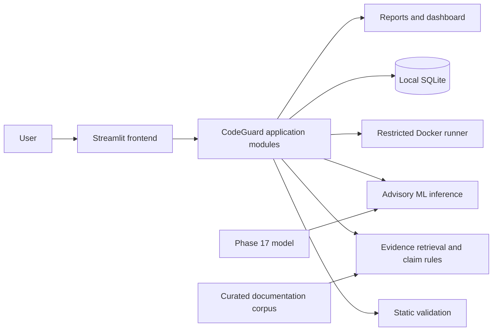

# CodeGuard AI

CodeGuard AI is a local research project for checking AI-generated Python answers.

The idea is fairly simple: instead of only looking at whether a piece of Python code is valid, CodeGuard looks at different parts of an AI answer separately. It can check the code, run it in a restricted Docker environment, test functions, look at possible risks, and inspect some of the claims made in the explanation.

It is still an active research/development project, so it should not be treated as a production security tool or as a guarantee that an answer is correct.

## What can CodeGuard do?

A user can paste a coding question and an AI-generated answer into the application.

CodeGuard can then:

- extract Python code and explanation text from the answer
- check the Python code with AST-based validation
- look for selected risky operations
- run the code inside Docker when Docker integration is enabled
- run user-provided function tests
- keep evaluation results in a local SQLite database
- compare saved responses
- extract a limited set of explanation claims
- search a small curated collection of official Python documentation
- compare some claims with the retrieved evidence
- optionally get an answer through the OpenAI Responses API
- show the different results together in a Streamlit dashboard

The checks are kept as separate signals. A successful execution, for example, does not automatically mean that the explanation is correct.

## How it is put together

The main pieces of the project are connected roughly like this:



The Streamlit app handles the user-facing part. The actual CodeGuard logic is kept in the `codeguard` package under `backend/src/`.

## Project structure

```text
frontend/       Streamlit application
backend/src/    Main CodeGuard package
  codeguard/    Analysis, execution, evidence, storage, reports, and ML
tests/          Unit, integration, Docker, and demo tests
data/           Datasets, local data, and metadata
models/         Trained model files and model information
scripts/        Dataset and training scripts
docs/           Architecture, research, phase reports, and demo guides
reports/        Example results and generated figures
```

## A few important details

### Code execution

CodeGuard does not fall back to running submitted code directly on the host.

When Docker-backed execution is used, the runner is configured with restrictions such as:

- networking disabled
- read-only root filesystem
- non-root user/group (`65534:65534`)
- 128 MiB memory limit
- 0.5 CPU limit
- 32-process limit
- execution timeouts
- output limits

These restrictions are intended to reduce risk during local testing. They are **not** a claim that Docker is a perfect or production-grade security boundary. This project should not be exposed as a public code-execution service.

### Explanation and evidence

CodeGuard also looks at the explanation that comes with the generated code.

For this part, it uses a small curated corpus based on official Python documentation. It uses retrieval and a set of narrow claim rules to check whether some extracted claims have supporting or contradicting evidence.

Retrieval similarity by itself is not treated as proof of truth. If the system cannot establish a claim from the available evidence, it should not pretend that it has.

## Machine learning part

There are a couple of ML-related experiments in the project.

The Phase 17 model is an auxiliary regressor trained on a bounded Python sample from NVIDIA OpenCodeReasoning-2. Its target is the source dataset's `pass_rate`.

That model is **not** a CodeGuard claim-verification model, and its prediction should not be interpreted as a general code-correctness or safety score.

There is also a smaller synthetic claim-verifier experiment. That is an additional signal for the research work, not a replacement for documentary evidence.

More details are available in:

- `docs/research/MODEL_CARD.md`
- `docs/research/PHASE_17_DATASET_RESEARCH.md`

## Dataset notes

The large raw Phase 17 Parquet files are intentionally not committed to the repository.

The repository keeps the dataset revision, source information, license notes, download metadata, and reproduction instructions instead.

The Phase 17 dataset is being used as an auxiliary execution/pass-rate source. It is **not** a human-labelled dataset for CodeGuard's claim-verification labels.

Some of the earlier research datasets are synthetic, and some proposed labels are still waiting for independent review.

See `data/README.md` for the dataset details.

## Running the project locally

You need Python 3.10 or newer.

Docker Desktop with its Linux engine is needed for the isolated execution features.

Create a virtual environment:

```powershell
py -m venv .venv
.\.venv\Scripts\Activate.ps1
python -m pip install -r requirements.txt
python -m pip install -e .
```

For development and testing, also install:

```powershell
python -m pip install -r requirements-dev.txt
```

### Optional OpenAI provider

The OpenAI integration is optional.

If you want to use it, copy `.env.example` to `.env` and set:

```text
OPENAI_API_KEY=your_key_here
```

The application reads the key from the process environment. `.env` loading is not automatic, so configure the environment accordingly.

API usage can also incur charges.

## Start the application

From the repository root:

```powershell
python -m streamlit run frontend/app.py
```

Streamlit will print the local address, normally:

```text
http://localhost:8501
```

### Accounts and access

The first screen offers user registration, user login, and separate developer access. User accounts are restricted to their own evaluations, reports, comparison results, and profile. Developer pages perform role checks against the SQLite account record on every rerun; hiding a navigation item is not the authorization boundary.

Passwords use salted `scrypt` hashes. They are never stored or logged in plaintext. To create the first developer account, run this once from the repository root after installing the project:

```powershell
python -m codeguard.auth_bootstrap developer@example.com
```

The command asks for the password through a hidden terminal prompt. Developer bootstrap is refused once an account with the `DEVELOPER` role exists. Normal registration can create `USER` accounts only.

Existing evaluation rows are preserved by additive SQLite migrations. Rows created before account ownership was added have no owner and are visible only to developers; user accounts cannot claim or see those records.

### User workspace

The User interface contains Home, New Evaluation, My Evaluations, Compare, and Profile. New Evaluation accepts pasted responses or an optional OpenAI Responses API request, extracts fenced/generic/unfenced AST-valid Python, and invokes the existing static validator, restricted Docker runner, optional function-test runner, explanation/evidence verifier, Phase 17 advisory model, and unified report builder. Docker, tests, and performance are marked unavailable or not run when the actual component cannot complete. Results remain separate signals; no combined correctness score is calculated.

My Evaluations is scoped by the authenticated user ID in its SQLite query, with search, status filters, sorting, pagination, and the stored detailed report. Reports include the original code, execution output, test outcomes, performance measurements, static findings, evidence-backed claims, ML metadata, and evaluation timestamps where those values were actually produced.

### Developer console

Developer access opens a separate console with Overview, Evaluations, Logs, System Health, Docker, ML, Evidence, Datasets, Users, and Settings. Counts and views read the local SQLite database, model metadata/artifact, corpus, dataset metadata, and log events. Health checks label unavailable components honestly. The Docker page can run a harmless Python runtime probe using the existing restrictive flags; it does not execute submitted user code as a health check.

Application events are stored as structured rows in the local SQLite database. Event details redact password/secret/token-shaped fields, avoid submitted response contents, and retain at most the newest 5,000 rows with bounded detail size. The log view and all health/observability pages require a developer role.

### Local configuration and privacy

`.env.example` lists optional environment settings; the application does not load `.env` automatically. `CODEGUARD_DATABASE_PATH` can select a local SQLite file, `CODEGUARD_ENV` and `LOG_LEVEL` identify the local environment/view settings, and `OPENAI_API_KEY` is read only when the user chooses the OpenAI provider. Never commit real values or runtime database files.

SQLite stores submitted prompts, responses, code, results, account names, password hashes, and application event metadata. Keep the local database private. This remains a local research/product prototype: Streamlit local session authentication is not enterprise identity, there is no email verification, MFA, password reset, or account deletion workflow, and Docker plus the host kernel are not a production security boundary.

If you want to use the Docker-backed execution features, make sure the execution image is available:

```powershell
docker pull python:3.12-slim
```

## Running the tests

The normal test suite can be run with:

```powershell
python -m pytest
```

Docker integration tests need a running Docker engine and are enabled explicitly:

```powershell
$env:CODEGUARD_DOCKER_INTEGRATION = "1"
python -m pytest tests/docker
```

## Demo

There are a few prepared examples showing different kinds of answers and failure cases.

Start with:

- `docs/demo/DEMO_GUIDE.md`
- `docs/demo/PHASE_18_DEMO_CASES.md`

Example machine-readable results are available in:

```text
reports/phase18/
```

## Current state

CodeGuard is still being developed.

The project has separate phase reports documenting the work done so far, including the dataset experiments, demo cases, and unified reporting work. The main progress log is:

`docs/phases/PROJECT_PROGRESS.md`

The ML numbers reported in this repository describe the particular datasets and evaluation procedures used in those experiments. They should not be read as production performance estimates.

## Known limitations

There are still several limitations:

- explanation verification currently covers only a relatively small set of claim patterns and documentation facts
- retrieval can miss useful evidence
- retrieval similarity is not a truth score
- the ML datasets are small or specific to their source domains
- the Phase 17 target comes from an upstream automated benchmark rather than human labels
- Docker and the host kernel can still contain vulnerabilities
- local SQLite files can contain prompts and generated responses that may be sensitive

## What is next?

The main areas for further work are:

- getting more human-reviewed claim data
- evaluating the system independently
- expanding the evidence coverage
- improving reproducibility
- continuing to test the execution restrictions and sandbox behaviour

The goal is to improve the evaluation system without weakening the existing execution restrictions.

## License

There is currently no project license file in the repository, so no project reuse license is claimed here.

Dataset and upstream-source licenses still apply where relevant. See `data/README.md` for the Phase 17 dataset notes.
